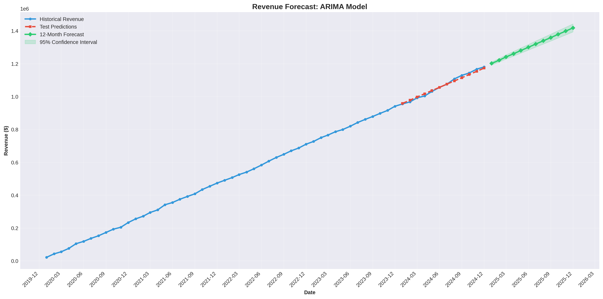
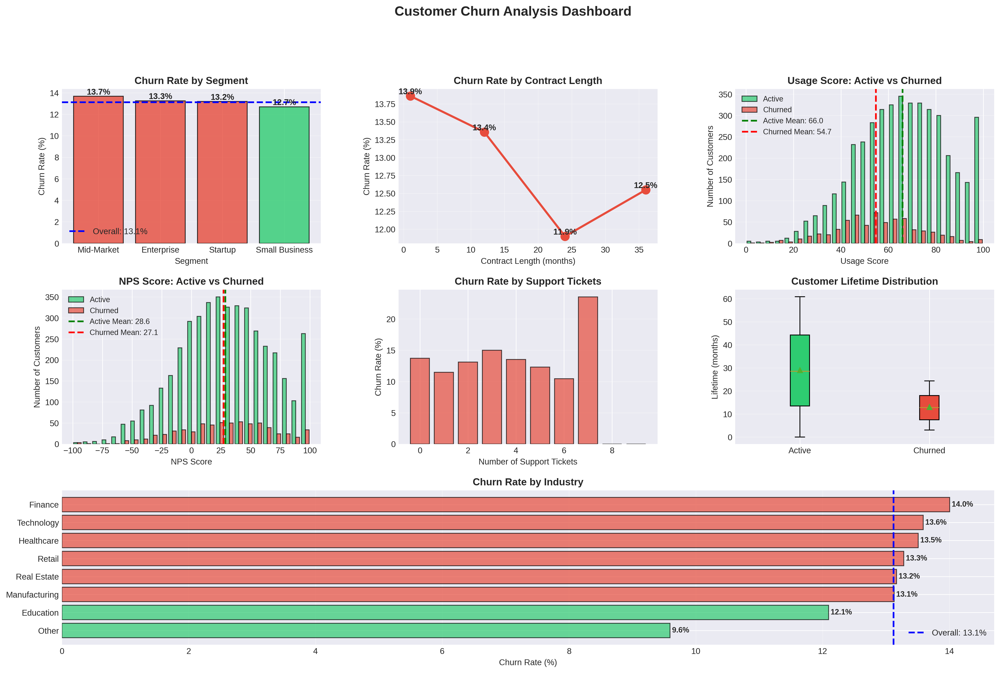
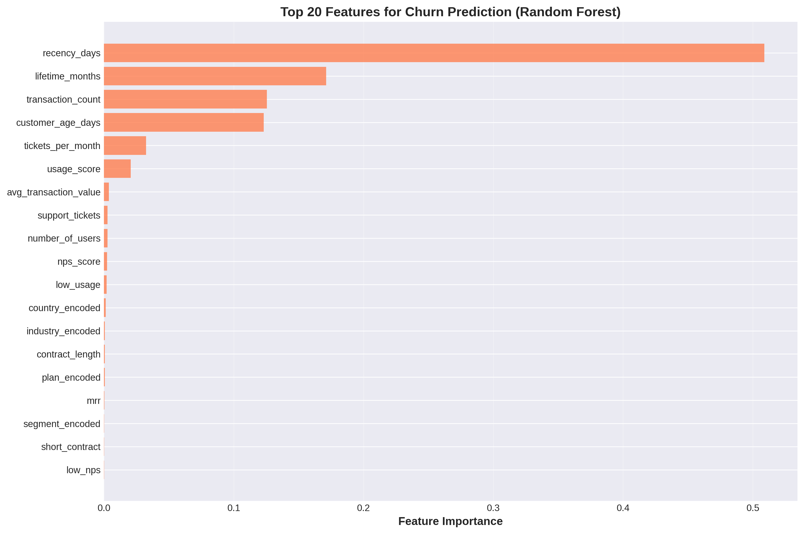
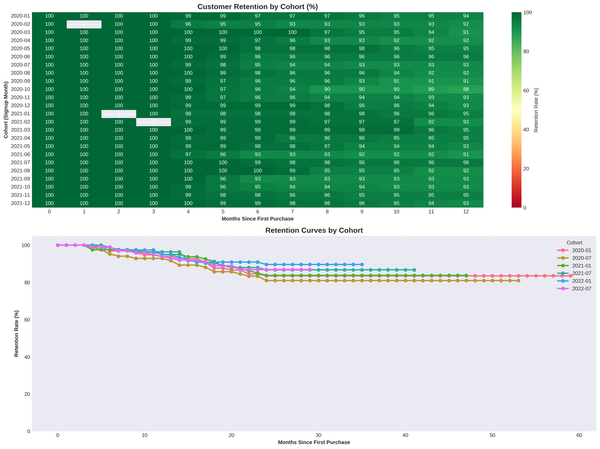
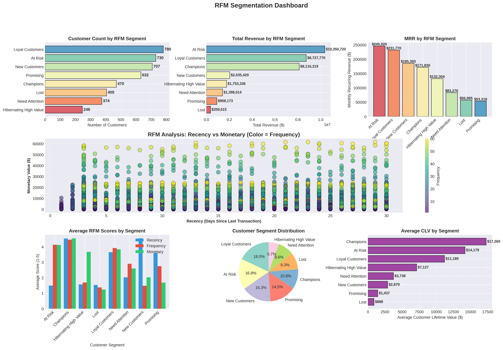
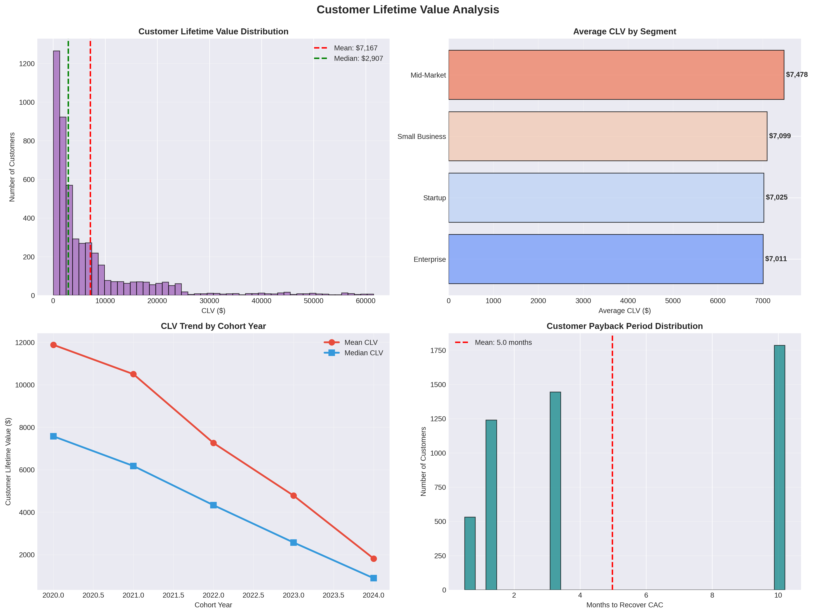
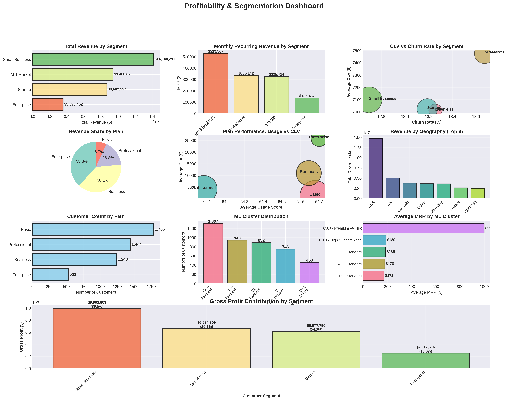
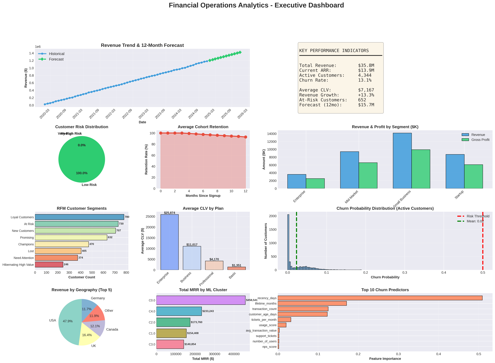

# Financial Operations and Analytics by Om

An end-to-end financial analytics project covering revenue forecasting, churn prediction, cohort analysis, customer segmentation, and profitability modeling for a SaaS subscription business.

This project simulates a real-world financial analytics workflow using synthetic but realistic transactional data spanning 2020 to 2024.

---

## Project Overview

This project demonstrates how financial data can be transformed into actionable business intelligence through:

- Time series revenue forecasting
- Machine learning-based churn prediction
- Cohort and retention analysis
- RFM customer segmentation
- Customer lifetime value modeling
- Profitability and contribution analysis
- Executive-level dashboard reporting

The entire analytics pipeline is implemented in Python.

---

## Updated Project Structure

```
Financial_operations_and_analytics_by_Om/
│
├── financial_analytics.py
├── financial_customers.csv
├── financial_transactions.csv
├── monthly_revenue.csv
├── at_risk_customers.csv
├── kpi_summary.txt
│
└── financial_viz/
    ├── 01_initial_exploration.png
    ├── 02_ts_decomposition.png
    ├── 03_acf_pacf_analysis.png
    ├── 04_arima_forecast.png
    ├── 05_prophet_forecast.png
    ├── 06_prophet_components.png
    ├── 07_churn_analysis.png
    ├── 08_churn_model_evaluation.png
    ├── 09_churn_feature_importance.png
    ├── 10_risk_stratification.png
    ├── 11_cohort_retention.png
    ├── 12_revenue_cohorts.png
    ├── 13_rfm_analysis.png
    ├── 14_clv_analysis.png
    ├── 15_profitability_dashboard.png
    └── 16_FINAL_EXECUTIVE_DASHBOARD.png
```

---

## Revenue Forecasting

### ARIMA Forecast



Time series modeling captures long-term trend and seasonality in subscription revenue and produces a 12-month forward projection with confidence intervals.

Techniques used:
- ADF stationarity testing
- Seasonal decomposition
- ACF and PACF diagnostics
- ARIMA modeling
- Prophet forecasting

---

## Churn Prediction Modeling



Machine learning models implemented:

- Logistic Regression
- Random Forest
- Gradient Boosting

Model evaluation includes:
- ROC-AUC
- Confusion matrix
- Precision and Recall
- Feature importance ranking

---

## Feature Importance



Key churn indicators include:

- Product usage score
- Customer satisfaction (NPS)
- Support ticket volume
- Contract duration

This enables proactive retention strategies.

---

## Cohort and Retention Analysis



Cohort analysis measures customer retention across acquisition periods and highlights long-term decay patterns.

Revenue cohort tracking identifies monetization behavior over time.

---

## RFM Customer Segmentation



Customers are segmented using:

- Recency
- Frequency
- Monetary value

Segments identified include:

- Champions
- Loyal Customers
- Promising
- At Risk
- Lost

This supports targeted engagement strategies.

---

## Customer Lifetime Value Analysis



Customer Lifetime Value modeling evaluates:

- Average revenue contribution
- Lifetime duration
- Payback period assumptions
- Segment-level value differences

---

## Profitability and Contribution Analysis



Profitability is analyzed by:

- Customer segment
- Subscription plan
- Geographic region
- Machine learning clusters

This identifies high-performing segments and revenue concentration risk.

---

## Executive Dashboard



The final dashboard consolidates:

- Revenue trends and forecast
- Churn risk distribution
- Cohort retention curves
- Segment profitability
- Top churn drivers

This simulates board-level financial reporting.

---

## Methodology

1. Synthetic data generation simulating a subscription-based SaaS business (2020–2024).
2. Data cleaning and feature engineering.
3. Exploratory data analysis and statistical validation.
4. Time series modeling for revenue forecasting.
5. Machine learning classification for churn prediction.
6. Cohort and segmentation analytics.
7. Executive-level visualization and reporting.

---

## Technologies Used

- Python
- Pandas
- NumPy
- Matplotlib
- Seaborn
- Scikit-learn
- Statsmodels
- Prophet
- SciPy

---

## Installation

Clone the repository:

```
git clone https://github.com/yourusername/Financial_operations_and_analytics_by_Om.git
cd Financial_operations_and_analytics_by_Om
```

Install dependencies:

```
pip install -r requirements.txt
```

Run the analysis:

```
python financial_analytics.py
```

---

## Skills Demonstrated

- Time Series Forecasting
- Predictive Modeling
- Financial KPI Interpretation
- Customer Retention Analytics
- RFM Segmentation
- Profitability Modeling
- Data Visualization
- End-to-End Analytics Pipeline Design

---

## License

This project is licensed under the MIT License.
